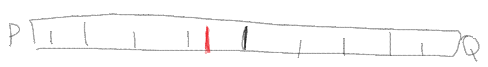

```{r}
#| output: false
library(tidyverse)
library(magrittr)
library(ggformula)
library(patchwork)

theme_set(theme_minimal())

set.seed(666)
```

Notes from lectures of intro course on information theory for machine learning by [Alex Alemi](https://www.alexalemi.com), later summarized in a [blog post](https://blog.alexalemi.com/kl-is-all-you-need.html):

- Lectures: [\[part I\]](https://youtu.be/WsLsEc-p3ww) [\[part II\]](https://youtu.be/hwZU-O0_12g) [\[part III\]](https://youtu.be/NYcJwXhVhuI)

- [\[slides\]](https://docs.google.com/presentation/d/1oSgexQc4hckbb4eWuMQCTplhR-OPRpK-bquW9_G3pbI/present?usp=sharing)

- [\[problem set\]](https://drive.google.com/file/d/1VdFc41xtayn6YY-ZsHlbOBSCEabmNRXs/view?usp=sharing)

- [\[solutions\]](https://drive.google.com/file/d/1jPUhUS5T2rgyx5Dlt74g4_MwX8vrBi2I/view?usp=sharing)

## Introduction

[Information theory](https://en.wikipedia.org/wiki/Information_theory) is a [recent invention](https://en.wikipedia.org/wiki/A_Mathematical_Theory_of_Communication) by [Claude Shannon](https://en.wikipedia.org/wiki/Claude_Shannon), who was primarily concerned with communication [@shannon1948]. We have to thank him for basically all things digital!

Here, we develop information theory from probability theory rather than in the original context of communication (see [curated list of books](https://franknielsen.github.io/Books/CuratedBookLists.html) by [Frank Nielsen](https://franknielsen.github.io/more.html)).

Fundamentally, information theory is about [measures](https://en.wikipedia.org/wiki/Information_theory_and_measure_theory):

- [weight of evidence](https://en.wikipedia.org/wiki/Bayes%27_theorem): measures the "importance" of data for distinguishing between two hypotheses

$$w[x;p,q] \equiv \log \frac{p(x)}{q(x)}$$

- [relative entropy](https://en.wikipedia.org/wiki/Kullback%E2%80%93Leibler_divergence) (a.k.a. Kullback–Leibler (KL) divergence): measures a "distance" between two distributions

$$\mathcal{S}[p;q] \equiv \sum p(x) \log \frac{p(x)}{q(x)}$$

- [entropy](https://en.wikipedia.org/wiki/Entropy_(information_theory)): measures the "complexity" of a distribution

$$\mathcal{S}[p] \equiv - \sum p(x) \log p(x)$$

- [mutual information](https://en.wikipedia.org/wiki/Mutual_information): measures the "complexity" of the association between two variables

$$\mathcal{I}(X;Y) \equiv \sum p(x,y) \log \frac{p(x,y)}{p(x)p(y)}$$

## Weight of evidence

In the beginning, there was Bayes' rule (joint probability/product rule factored/sliced two ways + algebra):

$$P(A,B) = P(A)P(B \mid A) = P(B)P(A \mid B) = P(B, A)$$

$$P(B \mid A) = \frac{P(B) P(A \mid B)}{P(A)}$$

All "frequentist vs. Bayesian, etc." controversies are rooted in the philosophical interpretation of this uncontroversial rule of probability theory when applied to statistical inference:

$$P(H \mid D) = \frac{P(H) P(D \mid H)}{P(D)}$$ where:

$P(H \mid D) = \text{the (posterior) probability of the hypothesis after observing the data}$

$P(H) = \text{the (prior) probability of the hypothesis before observing the data}$

$P(D \mid H) = \text{the probability of the observed data given the hypothesis (a.k.a. the likelihood of the hypothesis given the observed data)}$

$P(D) = \text{the (marginal) probability (a.k.a. evidence or marginal likelihood) of the observed data, computed by averaging over all hypotheses}$

For example, $P(H \mid D) = \frac{P(H) P(D \mid H)}{P(H) P(D \mid H)+ P(\lnot H) P(D \mid \lnot H)}$

The evidence/marginal likelihood is the tricky bit... so, let's get rid of it!

We begin by considering just two hypotheses $H_1$ and $H_2$:

$$\frac{P(H_1 \mid D)}{P(H_2 \mid D)} = \frac{P(H_1)}{P(H_2)} \frac{P(D \mid H_1)}{P(D \mid H_2)}$$

where:

$\frac{P(H_1 \mid D)}{P(H_2 \mid D)} = \text{the posterior odds}$

$\frac{P(H_1)}{P(H_2)} = \text{the prior odds}$

$\frac{P(D \mid H_1)}{P(D \mid H_2)} = \text{the Bayes' factor/likelihood ratio}$

Then, we log both sides:

$$\log \frac{P(H_1 \mid D)}{P(H_2 \mid D)} = \log \Big(\frac{P(H_1)}{P(H_2)} \frac{P(D \mid H_1)}{P(D \mid H_2)} \Big) =  \log \frac{P(H_1)}{P(H_2)} + \log \frac{P(D \mid H_1)}{P(D \mid H_2)}$$

where:

$\log \frac{P(H_1 \mid D)}{P(H_2 \mid D)} = \text{the posterior log odds}$

$\log \frac{P(H_1)}{P(H_2)} = \text{the prior log odds}$

$\log \frac{P(D \mid H_1)}{P(D \mid H_2)} = \text{the weight of evidence}$

The posterior log odds are prior log odds + the **weight of evidence**.

If you don't know what [odds](https://en.wikipedia.org/wiki/Odds) are (in the case of a single event):

$$\text{Odds}(A) = \frac{P(A)}{P(\lnot A)} = \frac{P(A)}{1 - P(A)}$$

For example:

$$P(A) = 0.5 = \frac{1}{2} \rightarrow \text{Odds}(A) = \frac{\frac{1}{2}}{\frac{1}{2}} = 1 = 1 : 1$$

$$P(A) = 0.75 = \frac{3}{4} \rightarrow \text{Odds}(A) = \frac{\frac{3}{4}}{\frac{1}{4}} = 3 = 3 : 1$$

More generally, odds are the ratio of any two probabilities, not necessarily $P(A)$ and $P(\lnot A)$, e.g., $\frac{P(H_1)}{P(H_2)}$.

> We define the logarithm of the likelihood ration as the **information** in data $X = x$ for discrimination in favor of $H_1$ against $H_2$, i.e., the **weight of evidence** for $H_1$ (against $H_2$) given data $X = x$.

### Change of notation

$$\begin{align}
P(X = x \mid P) & \rightarrow p(x) \\
P(X = x \mid Q) & \rightarrow q(x) \\
\end{align}$$

The probability that some variable $X$ takes on a value $x$ given that some model/hypothesis is true.

The weight of evidence is:

$$\log \frac{p(x)}{q(x)}$$

### Units of weight of evidence

Probability vs (logarithmic) evidence space to measure strength of belief.

$\log_2 : \text{bit, shannon}$

$\log_e : \text{nat}$

$\log_{10} : \text{dit, ban, hartley}$

$10\log_{10} : \text{deciban}$

```{r}
tribble(
  ~db, ~bit,  ~nat, ~odds,   ~p,
   0,  "0",   0.00, "1:1",   "50%",
   1,  "⅓",   0.23, "5:4",   "56%",
   2,  "⅔",   0.46, "π:2",   "61%",
   3,  "1",   0.69, "2:1",   "67%",
   4,  "1⅓",  0.92, "5:2",   "72%",
   5,  "1⅔",  1.15, "π:1",   "76%",
   6,  "2",   1.38, "4:1",   "80%",
   7,  "2⅓",  1.61, "5:1",   "83%",
   8,  "2⅔",  1.84, "2π:1",  "86%",
   9,  "3",   2.07, "8:1",   "89%",
  10,  "3⅓",  2.30, "10:1",  "91%",
  11,  "3⅔",  2.53, "4π:1",  "93%",
  12,  "4",   2.76, "16:1",  "94%",
  13,  "4⅓",  2.99, "20:1",  "95%",
  20,  "6⅔",  4.60, "99:1",  "99%"
)
```

Independent observations decompose additively in (logarithmic) evidence space, as opposed to multiplicatively in probability space.

$$\log \frac{p(x_1, x_2, \ldots)}{q(x_1, x_2, \ldots)} = \log \frac{p(x_1)\ p(x_2)\ \ldots}{q(x_1)\ q(x_2)\ \ldots} = \log \frac{p(x_1)}{q(x_1)} + \log \frac{p(x_2)}{q(x_2)} + \ldots $$

### Belief-O-Meter



#### Loaded die

$H_1 : \text{die is loaded, shows 6 1/3 of the times (and 1, 2, 3, 4, or 5 2/3 of the times)}$

$H_2 : \text{die is not loaded, shows 6 1/6 of the times (and 1, 2, 3, 4, or 5 5/6 of the times})$

$D : \text{die shows 6} \implies 10\log_{10}\frac{P(D \mid H_1)}{P(D \mid H_2)} = 10\log_{10}\frac{\frac{1}{3}}{\frac{1}{6}} = 10\log_{10}(2) \approx 3\ \text{dB}$

$D : \text{die shows 1, 2, 3, 4, or 5} \implies 10\log_{10}\frac{P(D \mid H_1)}{P(D \mid H_2)} = 10\log_{10}\frac{\frac{2}{3}}{\frac{5}{6}} = 10\log_{10}(0.8) \approx -1\ \text{dB}$

If we observe $\{1, 4, 6, 6\}$ then (assuming i.i.d.) the weight of the evidence is $-1 + (-1) + 3 + 3 = 4\ \text{dB}$. Thus, if our prior log odds were $0\ \text{dB}$ (i.e., $H_1$ and $H_2$ are equally likely, max entropy), then our posterior log odds are $4\ \text{dB}$ , corresponding to $16:1\ \text{odds}$ in favor of $H_1$ vs. $H_2$.

#### Human births

$H_1 : \text{human births are 50% ♂ and 50% ♀}$

$H_2 : \text{human births are 51% ♂ and 49% ♀}$

Laplace looked at Parisian birth records and found that between 1745 and 1770, 251,527 ♂ and 241,945 ♀ were born.

Thus, the weight of the evidence in favor of $H_1$ vs. $H_2$ is:

$$251,527 \cdot 10\log_{10} \frac{0.51}{0.50} + 241,945 \cdot 10\log_{10} \frac{0.49}{0.50} = 21,632 + (-21,228) = 404\ \text{dB}$$

corresponding to $2.51\times 10^{40}:1\ \text{odds}$ in favor of $H_1$ vs. $H_2$ (25.1 duodecillions to one).

#### COVID test

$H_1 : \text{you have COVID}$

$H_2 : \text{you don't have COVID}$

Typical sensitivity of a COVID test:

$$P(+ \mid \text{COVID}) = 0.94$$

Typical specificity of a COVID test:

$$P(- \mid \lnot\text{COVID}) = 0.96$$

Typical prevalence of COVID is between 0.5-1.5%. Thus, assuming 1% prevalence of COVID, i.e., $P{(\text{COVID})} = 0.01$:

$$10\log_{10}\frac{0.01}{0.99} \approx 10\log_{10}(0.0101) = -19.96$$

$D : + \implies 10\log_{10}\frac{P(+ \mid \text{COVID})}{P(+ \mid \lnot \text{COVID})} = 10\log_{10}\frac{0.94}{0.04} = 10\log_{10}(23.5) = 13.71\ \text{dB}$

$D : - \implies 10\log_{10}\frac{P(- \mid \text{COVID})}{P(- \mid \lnot \text{COVID})} = 10\log_{10}\frac{0.06}{0.96} = 10\log_{10}(0.0625) = -12.04\ \text{dB}$

So, if a person drawn at random from the population tests positive for COVID, they are only approx. 19% likely to have COVID:

$$-19.96 + 13.71 = -6.25\ \text{dB}$$

$$P = \frac{1}{1 + 10^{-\text{dB}/10}}$$

$$P(\text{COVID} \mid +) = \frac{1}{1 + 10^{0.625}} = \frac{1}{5.217} = 0.192$$

This conversion from odds (or dB) to probability is valid only when the odds are between complementary hypotheses (i.e., mutually exclusive and exhaustive hypotheses), so that $H_2=\neg H_1$ and $P(H_1)+P(H_2)=1$.

Complementary = mutually exclusive and collectively exhaustive:

$$H_1 \cap H_2 = \varnothing \quad \text{and} \quad H_1 \cup H_2 = \Omega$$

Equivalently:

$$P(H_1) + P(H_2) = 1$$

$$P(H_2) = 1 - P(H_1) = P(\lnot H_1)$$

#### M&Ms

{width="300"}

Bags of M&Ms produced at the Cleveland and Hackettstown factories differ in their color composition and are stamped with distinct codes: bags with `CLV` in their serial no. are from Cleveland, while bags with `HKP` in their serial no. are from Hackettstown.

The color proportions vary by factory as follows:

```{r}
d <- tribble(
  ~Color,    ~CLV,  ~HKP,  
  "Orange",  0.205, 0.250, 
  "Blue",    0.207, 0.250, 
  "Green",   0.198, 0.125, 
  "Red",     0.131, 0.125, 
  "Yellow",  0.135, 0.125, 
  "Brown",   0.124, 0.125, 
)

d
```

```{r}
p_ds <- d %>%
  pivot_longer(-c(Color), values_to = "p", names_to = "Factory") %>% 
  mutate(color = str_to_lower(Color)) %>% 
  gf_col(p ~ Color, fill = ~color) %>% 
  gf_facet_wrap(~ Factory, nrow = 2) +
  scale_fill_identity()
```

 

If `CLV` is $H_1$ and `HKP` is $H_2$, the weight of evidence is (rounded to two decimals):

```{r}
d %<>% mutate(dB = round(10*log10(CLV/HKP), 2)) %>% select(Color, dB)

d
```

```{r}
p_db <- gf_col(dB ~ Color, data = d) + ylim(c(-2.5, 2.5))
```

 

```{r}
p_ds / p_db
```

#### Continuous hypotheses

```{r}
d <- tibble(
  x  = seq(-5, 5, length.out = 101),
  d1 = dnorm(x),
  d2 = dnorm(x, 1),
  dB = 10 * log10(d1 / d2)
)

p_ds <- d %>%
  pivot_longer(c(d1, d2), names_to = "d", values_to = "y") %>%
  gf_line(y ~ x, color = ~d) %>%
  gf_vline(xintercept = 0.5, linetype = "dotted") %>%
  gf_hline(yintercept = 0, linewidth = .1) %>%
  gf_labs(y = "p", x = NULL) %>%
  gf_theme(legend.position = "none")

p_db <- d %>%
  gf_line(dB ~ x, color = "blue") %>%
  gf_vline(xintercept = 0.5, linetype = "dotted") %>%
  gf_hline(yintercept = 0, linewidth = .1) %>%
  gf_labs(y = "dB", x = "x")

p_ds / p_db
```

Blue line is weight of evidence $x$ for $H_1$ (red line) vs. $H_2$ (green line).

## Relative entropy (KL divergence)

The **relative entropy/Kullback–Leibler divergence** from $H_1$ to $H_2$ is the **expected weight of evidence** (log-likelihood ratio/Bayes' factor) of $H_1$ over $H_2$, assuming $P(D\mid H_1)$ is the true data-generating distribution.

::: callout-note
Unlike the KL divergence (which is a function of the two probability distributions $P_1$ and $P_2$), the weight of evidence is a function of the observed data $D$ and does not assume that either $P_1$ or $P_2$ is the true data-generating distribution.
:::

Let $P_1 = P(D\mid H_1)$ be the true data-generating distribution and $P_2 = P(D\mid H_2)$ be the alternative distribution.

$$D_{\mathrm{KL}}(P_1\|P_2)
=
\mathbb{E}_{D\sim P_1}
\left[
\log\frac{P(D\mid H_1)}{P(D\mid H_2)}
\right]
=
\mathbb{E}_{D\sim P_1}
\left[
\log\frac{P_1}{P_2}
\right]$$
or

$$\mathcal{S}[p;q]
=
\mathbb{E}_{x \sim p(x)}
\left[
\log\frac{p(x)}{q(x)}
\right]
=
\sum_i{p(x_i)}\ \log\frac{p(x_i)}{q(x_i)}
=
\Big\langle
\log\frac{p(x)}{q(x)}
\Big\rangle_p$$

 

Back to the M&Ms example, if `CLV` is $H_1$ and `HKP` is $H_2$, the weight of evidence is:

```{r}
d <- tribble(
  ~Color,    ~CLV,  ~HKP,  
  "Orange",  0.205, 0.250, 
  "Blue",    0.207, 0.250, 
  "Green",   0.198, 0.125, 
  "Red",     0.131, 0.125, 
  "Yellow",  0.135, 0.125, 
  "Brown",   0.124, 0.125, 
) %>% mutate(dB = 10*log10(CLV/HKP))

d
```

and the KL divergence is:

```{r}
#| echo: true
d %>% summarize(S = sum(CLV*dB)) %$% S
```

$\mathcal{S}[\text{CLV};\text{HKP}] = 0.1166\ \text{dB}$

------------------------------------------------------------------------

Back to the M&Ms example, if `HKP` is $H_1$ and `CLV` is $H_2$, the weight of evidence is:

```{r}
d <- tribble(
  ~Color,   ~HKP,  ~CLV,
  "Orange", 0.250, 0.205,
  "Blue",   0.250, 0.207,
  "Green",  0.125, 0.198,
  "Red",    0.125, 0.131,
  "Yellow", 0.125, 0.135,
  "Brown",  0.125, 0.124
) %>% mutate(dB = 10*log10(HKP/CLV))

d
```

and the KL divergence is:

```{r}
#| echo: true
d %>% summarize(S = sum(HKP*dB)) %$% S
```

$\mathcal{S}[\text{HKP};\text{CLV}] = 0.1078\ \text{dB}$

::: callout-important
The KL divergence is a measure of the "distance" between two probability distributions but it's not symmetric.
:::

## Entropy

xxx

## Mutual information

xxx
