```{r}
#| output: false
library(tidyverse)
library(magrittr)
library(ggformula)
library(patchwork)

theme_set(theme_minimal())

set.seed(666)
```

Notes from lectures of intro course on information theory for machine learning by [Alex Alemi](https://www.alexalemi.com), later summarized in a [blog post](https://blog.alexalemi.com/kl-is-all-you-need.html):

- Lectures: [\[part I\]](https://youtu.be/WsLsEc-p3ww) [\[part II\]](https://youtu.be/hwZU-O0_12g) [\[part III\]](https://youtu.be/NYcJwXhVhuI)

- [\[slides\]](https://docs.google.com/presentation/d/1oSgexQc4hckbb4eWuMQCTplhR-OPRpK-bquW9_G3pbI/present?usp=sharing)

- [\[problem set\]](https://drive.google.com/file/d/1VdFc41xtayn6YY-ZsHlbOBSCEabmNRXs/view?usp=sharing)

- [\[solutions\]](https://drive.google.com/file/d/1jPUhUS5T2rgyx5Dlt74g4_MwX8vrBi2I/view?usp=sharing)

See also @tishby2000 and [this](https://youtu.be/Yu72TBHlnTI) YouTube video.

## Introduction

[Information theory](https://en.wikipedia.org/wiki/Information_theory) is a [recent invention](https://en.wikipedia.org/wiki/A_Mathematical_Theory_of_Communication) by [Claude Shannon](https://en.wikipedia.org/wiki/Claude_Shannon), who was primarily concerned with communication [@shannon1948]. We have to thank him for basically all things digital!

Here, we develop information theory from probability theory rather than in the original context of communication (see [curated list of books](https://franknielsen.github.io/Books/CuratedBookLists.html) by [Frank Nielsen](https://franknielsen.github.io/more.html)).

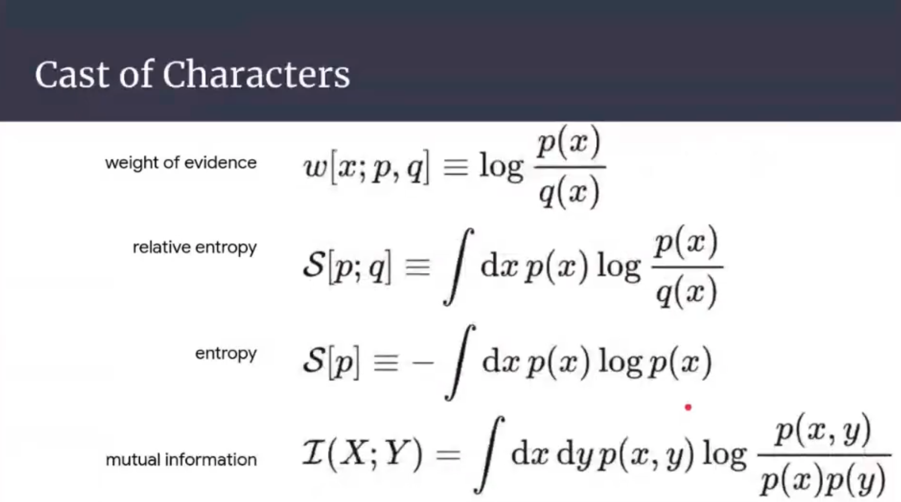

Fundamentally, information theory is about [measures](https://en.wikipedia.org/wiki/Information_theory_and_measure_theory):

- [Weight of evidence](https://en.wikipedia.org/wiki/Bayes%27_theorem): measures the "importance" of data for distinguishing between two hypotheses

$$W(x;p\|q) \equiv \log \frac{p(x)}{q(x)}$$

- [Kullback–Leibler (KL) divergence](https://en.wikipedia.org/wiki/Kullback%E2%80%93Leibler_divergence) (a.k.a. **relative entropy**): measures the "discrepancy" between two distributions

$$D_{\rm KL}(p\|q) \equiv \mathbb{E}_{x \sim p(x)}[W(x;p\|q)] = \sum_x p(x) \cdot \log \frac{p(x)}{q(x)}$$

- [Entropy](https://en.wikipedia.org/wiki/Entropy_(information_theory)): measures the "uncertainty" of a distribution

$$H(p) \equiv D_{\rm KL}(p\|u) = - \sum_x p(x) \cdot \log p(x)$$

- [Mutual information](https://en.wikipedia.org/wiki/Mutual_information): measures the "dependence" between two variables

$$I(X,Y) \equiv D_{\mathrm{KL}}(p(x,y)\|p(x)p(y)) = \sum_{x, y} p(x,y) \cdot \log \frac{p(x,y)}{p(x) p(y)}$$

## Weight of evidence

In the beginning, there was Bayes' rule (joint probability/product rule factored/sliced two ways + algebra):

$$\mathbb{P}(A,B) = \mathbb{P}(A)\cdot\mathbb{P}(B \mid A) = \mathbb{P}(B)\cdot\mathbb{P}(A \mid B) = \mathbb{P}(B, A)$$

$$\mathbb{P}(B \mid A) = \frac{\mathbb{P}(B)\cdot \mathbb{P}(A \mid B)}{\mathbb{P}(A)}$$

All "frequentist vs. Bayesian, etc." controversies are rooted in the philosophical interpretation of this uncontroversial rule of probability theory when applied to statistical inference:

$$\mathbb{P}(H \mid D) = \frac{\mathbb{P}(H)\cdot \mathbb{P}(D \mid H)}{\mathbb{P}(D)}$$ where:

$\mathbb{P}(H \mid D) =$ the (posterior) probability that the hypothesis is true after observing the data

$\mathbb{P}(H) =$ the (prior) probability of that the hypothesis is true before observing the data

$\mathbb{P}(D \mid H) =$ the probability of the observed data given the hypothesis; viewed as a function of $H$, this is the **likelihood** of the hypothesis given the observed data.

$\mathbb{P}(D) =$ the (marginal) probability (a.k.a. model evidence or marginal likelihood) of the observed data, computed by averaging over all hypotheses; it is also the prior predictive distribution

For example, if $\mathcal{H} = \{H, \lnot H \}$, then $\mathbb{P}(H \mid D) = \frac{\mathbb{P}(H) \cdot \mathbb{P}(D \mid H)}{\mathbb{P}(H) \cdot \mathbb{P}(D \mid H)+\mathbb{P}(\lnot H) \cdot \mathbb{P}(D \mid \lnot H)}$

We can avoid computing the model evidence/marginal likelihood by considering only two hypotheses $H_1$ and $H_2$ and comparing them using the ratio of their posterior probabilities (posterior odds):

$$\frac{\mathbb{P}(H_1 \mid D)}{\mathbb{P}(H_2 \mid D)} = \frac{\mathbb{P}(H_1)}{\mathbb{P}(H_2)} \cdot \frac{\mathbb{P}(D \mid H_1)}{\mathbb{P}(D \mid H_2)}$$

where:

$\frac{\mathbb{P}(H_1 \mid D)}{\mathbb{P}(H_2 \mid D)} = \text{the posterior odds}$

$\frac{\mathbb{P}(H_1)}{\mathbb{P}(H_2)} = \text{the prior odds}$

$\frac{\mathbb{P}(D \mid H_1)}{\mathbb{P}(D \mid H_2)} = \text{the Bayes' factor/likelihood ratio}$

The posterior odds (of $H_1$ over $H_2$) is the prior odds (of $H_1$ over $H_2$) multiplied by the Bayes' factor/likelihood ratio (of $H_1$ over $H_2$).

The Bayes' factor/likelihood ratio (of $H_1$ over $H_2$) is the multiplicative update for what my new belief should be in light of new evidence/data.

It can be turned into an additive update by logging both sides:

$$\log \frac{\mathbb{P}(H_1 \mid D)}{\mathbb{P}(H_2 \mid D)} = \log \Big(\frac{\mathbb{P}(H_1)}{\mathbb{P}(H_2)} \cdot \frac{\mathbb{P}(D \mid H_1)}{\mathbb{P}(D \mid H_2)} \Big) =  \log \frac{\mathbb{P}(H_1)}{\mathbb{P}(H_2)} + \log \frac{\mathbb{P}(D \mid H_1)}{\mathbb{P}(D \mid H_2)}$$

where:

$\log \frac{\mathbb{P}(H_1 \mid D)}{\mathbb{P}(H_2 \mid D)} = \text{the posterior log odds}$

$\log \frac{\mathbb{P}(H_1)}{\mathbb{P}(H_2)} = \text{the prior log odds}$

$\log \frac{\mathbb{P}(D \mid H_1)}{\mathbb{P}(D \mid H_2)} = \text{the weight of evidence}$

The posterior log odds are prior log odds + the **weight of evidence**.

If you don't know what [odds](https://en.wikipedia.org/wiki/Odds) are (in the case of a single event):

$$\text{Odds}(A) = \frac{\mathbb{P}(A)}{\mathbb{P}(\lnot A)} = \frac{\mathbb{P}(A)}{1 - \mathbb{P}(A)}$$

For example:

$$\mathbb{P}(A) = 0.5 = \frac{1}{2} \rightarrow \text{Odds}(A) = \frac{\frac{1}{2}}{1 - \frac{1}{2}} = \frac{\frac{1}{2}}{\frac{1}{2}} = \frac{1}{1} = 1 : 1 = 1$$

$$\mathbb{P}(A) = 0.75 = \frac{3}{4} \rightarrow \text{Odds}(A) = \frac{\frac{3}{4}}{1 - \frac{3}{4}} = \frac{\frac{3}{4}}{\frac{1}{4}} = \frac{3}{1} = 3 : 1 = 3$$

More generally, odds are the ratio of any two probabilities, not necessarily $\mathbb{P}(A)$ and $\mathbb{P}(\lnot A)$, e.g., $\frac{\mathbb{P}(H_1)}{\mathbb{P}(H_2)}$.

In the words of I. J. Good and Alan Turing, the weight of evidence (WoE) is a measure of the information in the data $D$ (or $X = x$) in favor of $H_1$ vs. $H_2$.

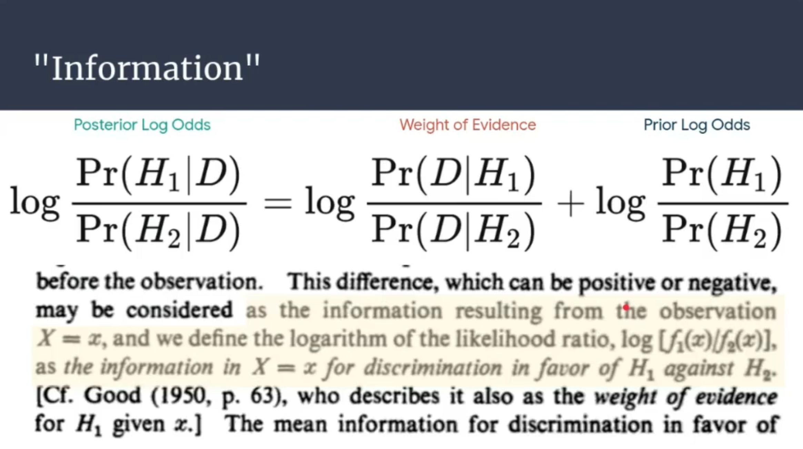

In other words, the weight of evidence of observation $x$ in favor of $H_1$ vs. $H_2$, measures the change in your belief (on the log-odds scale) in favor of $H_1$ vs. $H_2$ after observing $x$:

$$W(x;H_1\|H_2)
=
\underbrace{\log\frac{\mathbb{P}(H_1\mid x)}{\mathbb{P}(H_2\mid x)}}_{\text{your belief after observing }x}
-
\underbrace{\log\frac{\mathbb{P}(H_1)}{\mathbb{P}(H_2)}}_{\text{your belief before observing }x}
=
\log\frac{\mathbb{P}(x\mid H_1)}{\mathbb{P}(x\mid H_2)}$$

### Units of weight of evidence

Weight of evidence of observation $x$ in favor of $H_1$ vs. $H_2$ is magnitude of belief update in favor of $H_1$ vs. $H_2$ after observing $x$.

$\log_2 : \text{bit, shannon}$

$\log_e : \text{nat}$

$\log_{10} : \text{dit, ban, hartley}$

$10\log_{10} : \text{deciban}$

```{r}
tribble(
  ~dB, ~bit,  ~nat, ~odds,   ~ℙ,
   0,  "0",   0.00, "1:1",   "50%",
   1,  "⅓",   0.23, "5:4",   "56%",
   2,  "⅔",   0.46, "π:2",   "61%",
   3,  "1",   0.69, "2:1",   "67%",
   4,  "1⅓",  0.92, "5:2",   "72%",
   5,  "1⅔",  1.15, "π:1",   "76%",
   6,  "2",   1.38, "4:1",   "80%",
   7,  "2⅓",  1.61, "5:1",   "83%",
   8,  "2⅔",  1.84, "2π:1",  "86%",
   9,  "3",   2.07, "8:1",   "89%",
  10,  "3⅓",  2.30, "10:1",  "91%",
  11,  "3⅔",  2.53, "4π:1",  "93%",
  12,  "4",   2.76, "16:1",  "94%",
  13,  "4⅓",  2.99, "20:1",  "95%",
  20,  "6⅔",  4.60, "99:1",  "99%"
)
```

### Change of notation

$$\begin{align}
\mathbb{P}(X = x \mid P) & \rightarrow p(x) \\
\mathbb{P}(X = x \mid Q) & \rightarrow q(x) \\
\end{align}$$

The probability (mass/density[^1]) that some variable $X$ takes on a value $x$ given that some model/hypothesis/theory $P$ or $Q$ is true.

[^1]: $$\mathbb{P}(x < X < x + dx \mid P) = p(x)\;dx$$

    The $dx$ factor disappears when taking the ratio.

The weight of evidence (also in distributional form) is:

$$W(x;p\|q) \equiv \log \frac{p(x)}{q(x)}$$

### Weight of evidence of independent observations

If $X_1, X_2, \ldots$ are independent conditional on $P$ and conditional on $Q$, then the weight of evidence decomposes additively:

$$\log \frac{p(x_1, x_2, \ldots)}{q(x_1, x_2, \ldots)} = \log \frac{p(x_1)\ p(x_2)\ \ldots}{q(x_1)\ q(x_2)\ \ldots} = \log \frac{p(x_1)}{q(x_1)} + \log \frac{p(x_2)}{q(x_2)} + \ldots $$

### Belief-O-Meter

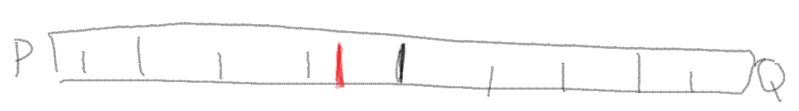

The belief-o-meter has the two hypotheses, $P$ on the left and $Q$ on the right.

For example:

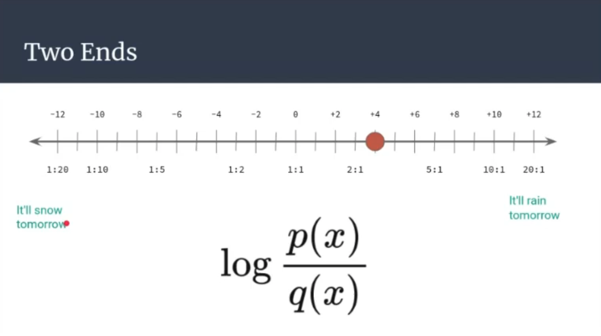

Note that $P$ and $Q$ don't have to be exhaustive.

### Example: Loaded die

$H_1 : \text{die is loaded, shows ⚅ 1/3 of the times (and ⚀, ⚁, ⚂, ⚃, or ⚄ 2/3 of the times)}$

$H_2 : \text{die is not loaded, shows ⚅ 1/6 of the times (and ⚀, ⚁, ⚂, ⚃, or ⚄ 5/6 of the times})$

$D : \text{die shows ⚅ } \implies W(D; H_1\|H_2) = 10\log_{10}\frac{\mathbb{P}(D \mid H_1)}{\mathbb{P}(D \mid H_2)} = 10\log_{10}\frac{\frac{1}{3}}{\frac{1}{6}} = 10\log_{10}(2) \approx 3\ \text{dB}$

$D : \text{die shows ⚀, ⚁, ⚂, ⚃, or ⚄ } \implies W(D; H_1\|H_2) = 10\log_{10}\frac{\mathbb{P}(D \mid H_1)}{\mathbb{P}(D \mid H_2)} = 10\log_{10}\frac{\frac{2}{3}}{\frac{5}{6}} = 10\log_{10}(0.8) \approx -1\ \text{dB}$

If we observe $\{⚀, ⚃, ⚅, ⚅ \}$ then (assuming independence) the weight of the evidence is $-1 + (-1) + 3 + 3 = 4\ \text{dB}$.

Thus, if our prior log odds were $0\ \text{dB}$ (i.e., $H_1$ and $H_2$ are equally likely), then our posterior log odds are $4\ \text{dB}$ , corresponding to $16:1\ \text{odds}$ in favor of $H_1$ vs. $H_2$.

### Example: Human births

$H_1 : \text{human births are 50\% ♂ and 50\% ♀}$

$H_2 : \text{human births are 51\% ♂ and 49\% ♀}$

Laplace looked at Parisian birth records and found that between 1745 and 1770, $251,527$ ♂ and $241,945$ ♀ were born (for a total of $493,472$ human births).

Thus, the weight of the evidence in favor of $H_1$ vs. $H_2$ (assuming independence) is:

$$251,527 \cdot 10\log_{10} \frac{0.51}{0.50} + 241,945 \cdot 10\log_{10} \frac{0.49}{0.50} = 21,632 + (-21,228) = 404\ \text{dB}$$

corresponding to $2.51\times 10^{40}:1\ \text{odds}$ in favor of $H_1$ vs. $H_2$.

### Example: COVID test

$H_1 : \text{you have COVID}$

$H_2 : \text{you don't have COVID}$

Typical sensitivity of a COVID test:

$$\mathbb{P}(+ \mid \text{COVID}) = 0.94$$

Typical specificity of a COVID test:

$$\mathbb{P}(- \mid \lnot\text{COVID}) = 0.96$$

Assuming 5% prevalence of COVID, i.e., $\mathbb{P}{(\text{COVID})} = 0.05$:

$$10\log_{10}\frac{0.05}{0.95} \approx 10\log_{10}(0.0526) = -12.79$$

$D : + \implies 10\log_{10}\frac{\mathbb{P}(+ \mid \text{COVID})}{\mathbb{P}(+ \mid \lnot \text{COVID})} = 10\log_{10}\frac{0.94}{0.04} = 10\log_{10}(23.5) = 13.71\ \text{dB}$

$D : - \implies 10\log_{10}\frac{\mathbb{P}(- \mid \text{COVID})}{\mathbb{P}(- \mid \lnot \text{COVID})} = 10\log_{10}\frac{0.06}{0.96} = 10\log_{10}(0.0625) = -12.04\ \text{dB}$

So, if a person drawn at random from a population with 5% prevalence tests positive for COVID, they are approx. 55% likely to have COVID:

$$-12.79 + 13.71 = 0.92\ \text{dB}$$

$$\mathbb{P} = \frac{1}{1 + 10^{-\text{dB}/10}}$$

$$\mathbb{P}(\text{COVID} \mid +) = \frac{1}{1 + 10^{-0.92/10}}
=
\frac{1}{1+10^{-0.092}} = 0.5528$$

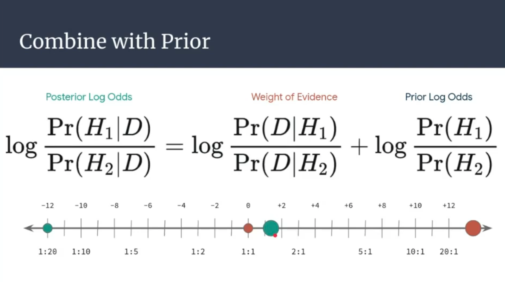

::: callout-note
Today's posterior is tomorrow's prior:

$$\begin{align}
p(\theta\mid D_1)
& \propto
p(D_1\mid\theta) \cdot p(\theta) \\
\\
p(\theta\mid D_1,D_2)
& \propto
p(D_2\mid D_1,\theta) \cdot
p(\theta\mid D_1) \\
\end{align}$$

If $D_2 \perp D_1\mid\theta$, then

$$p(D_2\mid D_1,\theta)=p(D_2\mid\theta)$$

and

$$\begin{align}
p(\theta\mid D_1,D_2) & \propto p(D_2\mid\theta) \cdot p(\theta\mid D_1)
\end{align}$$
:::

### Example: Personally Identifiable Information (PII)

PII is any data that can trace an identity back to a specific person.

It's estimated that 87% of the U.S. population can be identified using just three pieces of PII: gender, zip code, and birth date.

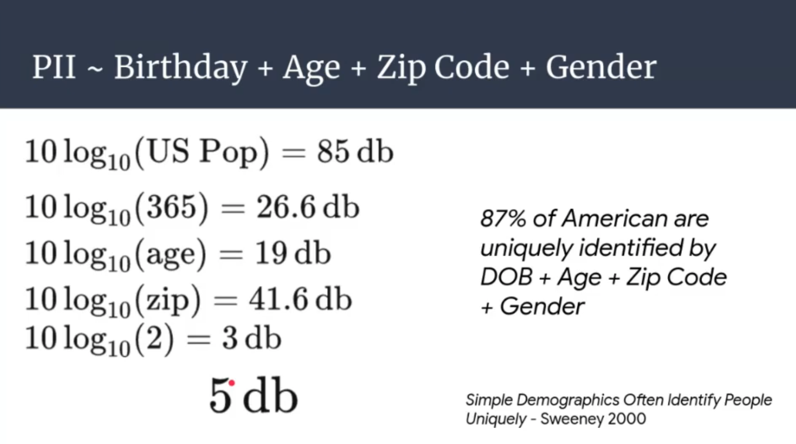

### Example: M&Ms (discrete distributions)

{width="300"}

Bags of M&Ms produced at the Cleveland and Hackettstown factories differ in their color composition and are stamped with distinct codes: bags with `CLV` in their serial no. are from Cleveland (OH), while bags with `HKP` in their serial no. are from Hackettstown (NJ).

<https://qz.com/918008/the-color-distribution-of-mms-as-determined-by-a-phd-in-statistics>

The color proportions vary by factory as follows:

```{r}
d <- tribble(
  ~Color,    ~`P(Color | OH)`,  ~`P(Color | NJ)`,  
  "Orange",  0.205, 0.250, 
  "Blue",    0.207, 0.250, 
  "Green",   0.198, 0.125, 
  "Red",     0.131, 0.125, 
  "Yellow",  0.135, 0.125, 
  "Brown",   0.124, 0.125, 
) %>% arrange(Color)

d
```

```{r}
p_ds <- d %>%
  pivot_longer(-c(Color), values_to = "p", names_to = "Factory") %>% 
  mutate(color = str_to_lower(Color), Factory = fct_relevel(Factory, "P(Color | OH)")) %>%
  arrange(color) %>% 
  gf_col(p ~ Color, fill = ~color) %>% 
  gf_facet_wrap(~ Factory, nrow = 2) +
  scale_fill_identity()
```

 

If `OH` is $H_1$ and `NJ` is $H_2$, the weight of evidence in favor of $OH$ vs. $NJ$ is (in decibans):

```{r}
d %<>% mutate(`W(Color;OH,NJ) [dB]` = 10*log10(`P(Color | OH)`/`P(Color | NJ)`)) %>% select(Color, `W(Color;OH,NJ) [dB]`)

d
```

```{r}
p_db <- gf_col(`W(Color;OH,NJ) [dB]` ~ Color, data = d) + ylim(c(-2.5, 2.5))
```

 

```{r}
p_ds / p_db
```

On the other hand, if `NJ` is $H_1$ and `OH` is $H_2$, the weight of evidence in favor of $NJ$ vs. $OH$ is (in decibans):

```{r}
d <- tribble(
  ~Color,    ~`P(Color | OH)`,  ~`P(Color | NJ)`,  
  "Orange",  0.205, 0.250, 
  "Blue",    0.207, 0.250, 
  "Green",   0.198, 0.125, 
  "Red",     0.131, 0.125, 
  "Yellow",  0.135, 0.125, 
  "Brown",   0.124, 0.125, 
) %>% arrange(Color)

p_ds <- d %>%
  pivot_longer(-c(Color), values_to = "p", names_to = "Factory") %>% 
  mutate(color = str_to_lower(Color), Factory = fct_relevel(Factory, "P(Color | NJ)")) %>% 
  arrange(color) %>% 
  gf_col(p ~ Color, fill = ~color) %>% 
  gf_facet_wrap(~ Factory, nrow = 2) +
  scale_fill_identity()

d %<>% mutate(`W(Color;NJ,OH) [dB]` = 10*log10(`P(Color | NJ)`/`P(Color | OH)`)) %>% select(Color, `W(Color;NJ,OH) [dB]`)

d
```

```{r}
p_db <- gf_col(`W(Color;NJ,OH) [dB]` ~ Color, data = d) + ylim(c(-2.5, 2.5))
```

 

```{r}
p_ds / p_db
```

### Example: Two Gaussian likelihoods (continuous distributions)

```{r}
d <- tibble(
  x  = seq(-5, 5, length.out = 101),
  d1 = dnorm(x),
  d2 = dnorm(x, 1),
  dB = 10 * log10(d1 / d2)
)

p_ds <- d %>%
  pivot_longer(c(d1, d2), names_to = "d", values_to = "y") %>%
  gf_line(y ~ x, color = ~d) %>%
  gf_vline(xintercept = 0.5, linetype = "dotted") %>%
  gf_hline(yintercept = 0, linewidth = .1) %>%
  gf_labs(y = "p", x = NULL) %>%
  gf_theme(legend.position = "none")

p_db <- d %>%
  gf_line(dB ~ x, color = "blue") %>%
  gf_vline(xintercept = 0.5, linetype = "dotted") %>%
  gf_hline(yintercept = 0, linewidth = .1) %>%
  gf_labs(y = "dB", x = "x")

p_ds / p_db
```

The blue line is weight of evidence for each possible observation $x$ in favor of $H_1$ (red line) vs. $H_2$ (green line). At $x=0.5$, the two hypotheses assign equal density, so the observation of $x = 0.5$ provides **zero weight of evidence**.

## KL divergence

Back to the M&Ms example, the weight of evidence in favor of $OH$ vs. $NJ$ is (in decibans):

```{r}
d <- tribble(
  ~Color,    ~`P(Color | OH)`,  ~`P(Color | NJ)`,  
  "Orange",  0.205, 0.250, 
  "Blue",    0.207, 0.250, 
  "Green",   0.198, 0.125, 
  "Red",     0.131, 0.125, 
  "Yellow",  0.135, 0.125, 
  "Brown",   0.124, 0.125, 
) %>% arrange(Color) %>%
  mutate(`W(Color;OH,NJ) [dB]` = 10*log10(`P(Color | OH)`/`P(Color | NJ)`))

d
```

The **Kullback–Leibler divergence** of $OH$ vs. $NJ$ is the **expected weight of evidence** in favor of $OH$ vs. $NJ$, assuming the bag is from $OH$, i.e., $P(\text{Color} \mid OH)$:

```{r}
#| echo: true
d %>% summarize(`DKL(OH;NJ) [dB]` = sum(`P(Color | OH)`*`W(Color;OH,NJ) [dB]`))
```

On the other hand, Back to the M&Ms example, the weight of evidence in favor of $NJ$ vs. $OH$ is (in decibans):

```{r}
d <- tribble(
  ~Color,    ~`P(Color | OH)`,  ~`P(Color | NJ)`,  
  "Orange",  0.205, 0.250, 
  "Blue",    0.207, 0.250, 
  "Green",   0.198, 0.125, 
  "Red",     0.131, 0.125, 
  "Yellow",  0.135, 0.125, 
  "Brown",   0.124, 0.125, 
) %>% arrange(Color) %>%
  mutate(`W(Color;NJ,OH) [dB]` = 10*log10(`P(Color | NJ)`/`P(Color | OH)`))

d
```

The **Kullback–Leibler divergence** of $NJ$ vs. $OH$ is the **expected weight of evidence** in favor of $NJ$ vs. $OH$, assuming the bag is from $NJ$, i.e., $\mathbb{P}(\text{Color} \mid NJ)$:

```{r}
#| echo: true
d %>% summarize(`DKL(NJ;OH) [dB]` = sum(`P(Color | NJ)`*`W(Color;NJ,OH) [dB]`))
```

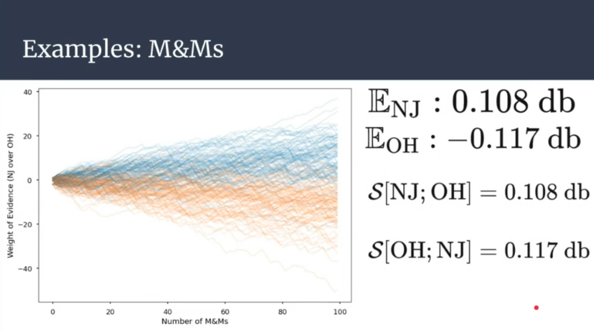

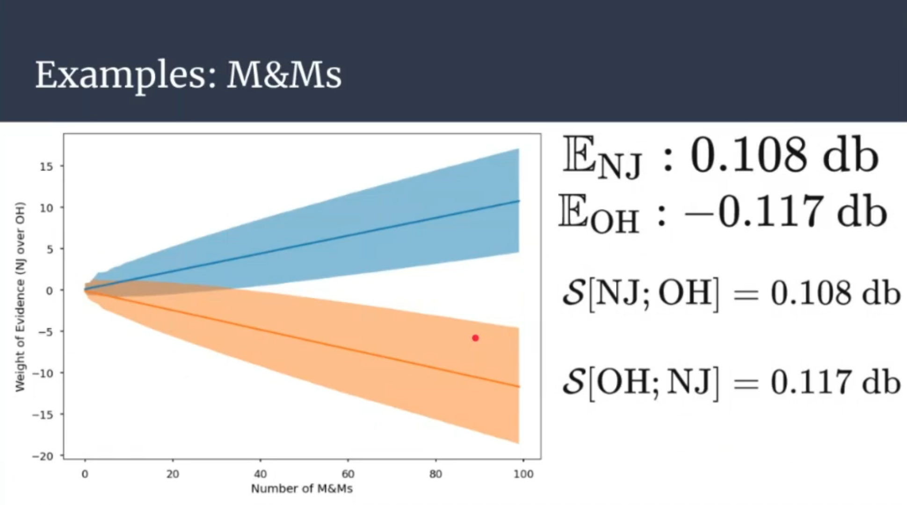

In general,

$$D_{\rm KL}(p\|q)
\equiv
\mathbb{E}_{x \sim p(x)}
\left[
\log \frac{p(x)}{q(x)}
\right]
=
\sum_x p(x) \cdot \log \frac{p(x)}{q(x)}$$

- The KL divergence of $p$ vs. $q$ is the expected weight of evidence in favor of $P$ vs. $Q$ of an observation $x$ drawn from $p$.

- The KL divergence of $p$ vs. $q$ is the expected magnitude of belief update (on the log-odds scale) in favor of $P$ vs. $Q$ after observing an outcome drawn from $p$.

- The KL divergence of $p$ vs. $q$ quantifies how far, on average, an observation drawn from $p$ is expected to move the “belief-o-meter” in favor of $P$ vs. $Q$.

- The KL divergence of $p$ vs. $q$ quantifies how much information, on average, an observation $x$ drawn from $p$ provides in favor of $P$ relative to $Q$.

- When $p$ is the "true" data-generating distribution, the KL divergence of $p$ vs. $q$ measures the expected excess surprisal incurred by using model $q$ rather than $p$.

Individual observations drawn from $p$ can provide evidence in favor of either $P$ or $Q$, but on average they provide evidence in favor of P; consequently, KL divergence is nonnegative.

For the KL divergence to be finite, $q$ cannot assign zero probability where $p$ assigns positive probability. If it does, the KL divergence is infinite.

Unlike weight of evidence, which depends on $p$, $q$, and a particular observation $x$, KL divergence depends only on the two distributions $p$ and $q$.

::: callout-important
The KL divergence measures the "distance" between two probability distributions, but it's not symmetric.
:::



<https://gist.github.com/ariseff/cbcfd58d05abe7ec388bb4bbc9914ad9>

How many observations are needed to accumulate enough evidence to decisively favor $P$ vs. $Q$ (e.g., reaching a Bayes factor of $13\ \text{dB} \approx 20:1$, corresponding to a posterior probability of approximately $95\%$ under equal prior odds) assuming $P$ is true?

$$N_{\rm eff} = \frac{13\ \text{dB}}{D_{\rm KL}(p\|q)}$$

For example, $\approx 15,000$ human birth records are needed to accumulate $13\ \text{dB}$ of evidence in favor of a 51:49% male:female birth rate ($H_1$) vs. a 50:50% male:female birth rate ($H_2$) assuming $H_1$ is true:

$$0.51 \cdot 10\log_{10} \frac{0.51}{0.50} + 0.49 \cdot 10\log_{10} \frac{0.49}{0.50} \approx 0.51 \times (0.0860) + 0.49 \times (-0.0877) \approx 0.000869\ \text{dB/human birth}$$

$$N_{\rm eff} = \frac{13\ \text{dB}}{0.000869\ \text{dB/human birth}} = 14,966\ \text{human births}$$

With Laplace’s sample of $493,472$ human birth records, the accumulated evidence was $\approx 404\ \text{dB}$—far exceeding the $13\ \text{dB}$ threshold needed for statistical decisiveness.

## Weight of evidence and surprise

If $H_2$ is exhaustive, for example:

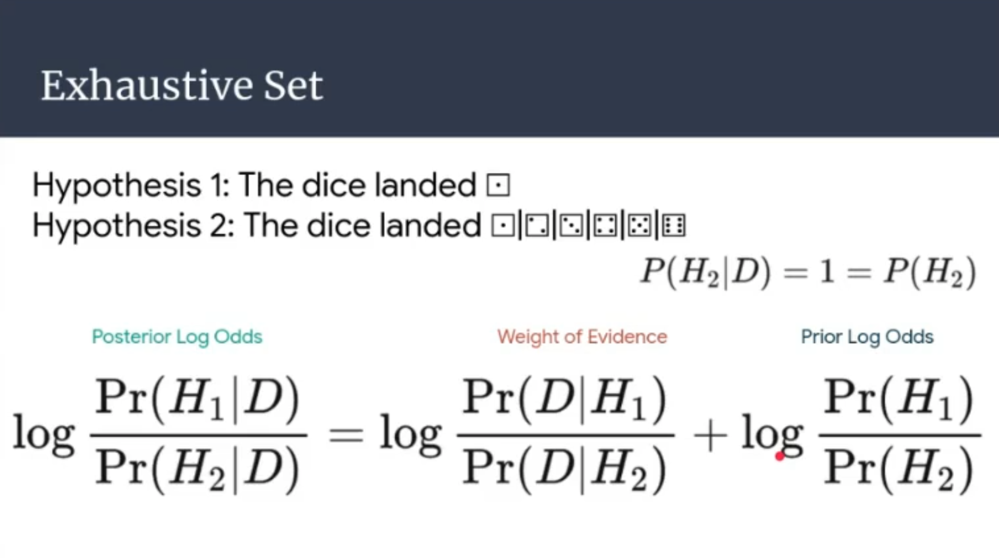

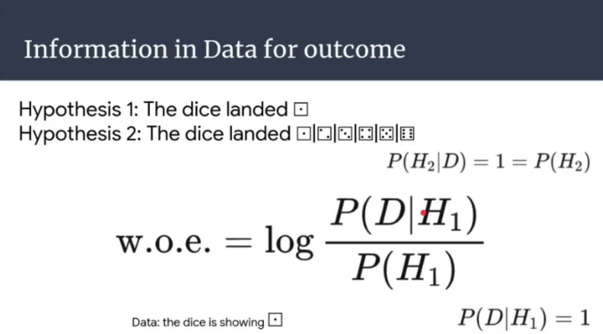

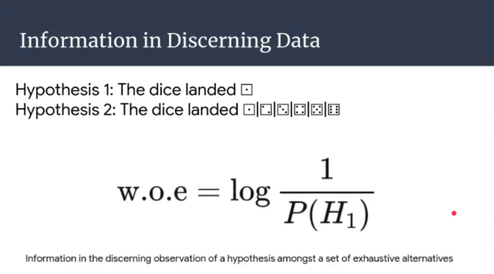

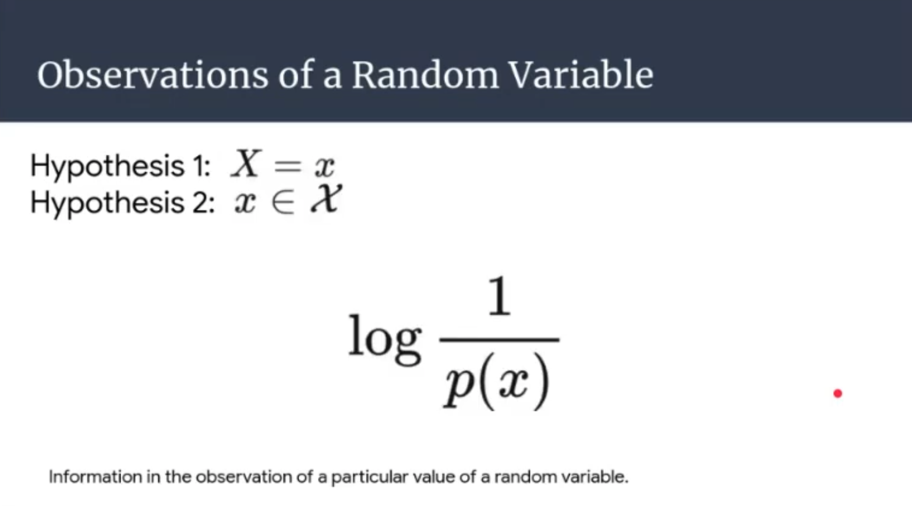

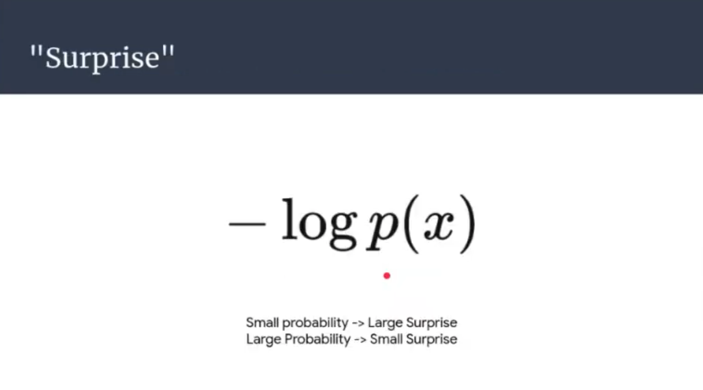

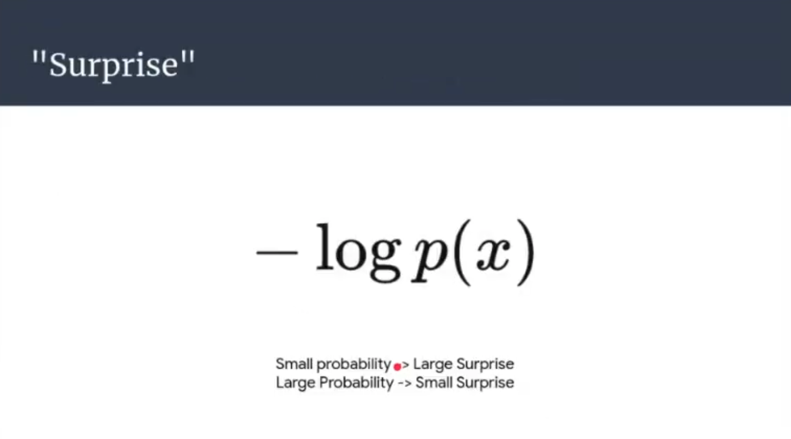

$$\begin{align}
H_1 &=  ⚀ \\
H_2 &= \{ ⚀, ⚁, ⚂, ⚃, ⚄, ⚅ \} = \Omega \\
\end{align}$$

$$\mathbb{P}(H_2 \mid D) = 1 = \mathbb{P}(H_2)$$

$$\log \frac{\mathbb{P}(H_1 \mid D)}{\mathbb{P}(H_2 \mid D)}
=
\log \frac{\mathbb{P}(D \mid H_1)}{\mathbb{P}(D \mid H_2)}
+
\log \frac{\mathbb{P}(H_1)}{\mathbb{P}(H_2)}$$

$$\log \frac{\mathbb{P}(H_1 \mid D)}{1}
=
\log \frac{\mathbb{P}(D \mid H_1)}{\mathbb{P}(D \mid H_2)}
+
\log \frac{\mathbb{P}(H_1)}{1}$$

$$\log \mathbb{P}(H_1 \mid D)
=
\log \frac{\mathbb{P}(D \mid H_1)}{\mathbb{P}(D \mid H_2)}
+
\log \mathbb{P}(H_1)$$

$$\log \frac{\mathbb{P}(D \mid H_1)}{\mathbb{P}(D \mid H_2)}
=
\log \mathbb{P}(H_1 \mid D) - \log \mathbb{P}(H_1)
=
\log \frac{\mathbb{P}(H_1 \mid D)}{\mathbb{P}(H_1)}$$

$$W(D;H_1\|H_2) = \log \frac{\mathbb{P}(H_1 \mid D)}{\mathbb{P}(H_1)}$$

$$W(D;H_1\|\Omega) = \log \frac{\mathbb{P}(H_1 \mid D)}{\mathbb{P}(H_1)}$$

Let $D = ⚀ = H_1$,

$$\mathbb{P}(H_1 \mid D) = \mathbb{P}(H_1 \mid H_1) = 1$$

$$W(H_1;H_1\|\Omega) = \log \frac{1}{\mathbb{P}(H_1)} = - \log \mathbb{P}(H_1)$$

Shannon's surprisal (or self-information) = information gained when observing an event occur amongst an exhaustive set of events.

$$\begin{align}
H_1 : X = x \\
H_2 : x \in \mathcal{X} \\
\end{align}$$

$$S(x) = \log \frac{1}{p(x)} = - \log p(x)$$

## Weight of evidence and surprise

Let $H_1$ and $H_2$ be two hypotheses, and let $D$ be observed data.

The posterior log-odds can be written as:

$$\log \frac{\mathbb{P}(H_1 \mid D)}{\mathbb{P}(H_2 \mid D)}
=
\log \frac{\mathbb{P}(D \mid H_1)}{\mathbb{P}(D \mid H_2)}
+
\log \frac{\mathbb{P}(H_1)}{\mathbb{P}(H_2)}$$

The first term on the right-hand side is the **weight of evidence** in favor of $H_1$ vs. $H_2$:

$$W(D; H_1\|H_2)
=
\log \frac{\mathbb{P}(D \mid H_1)}{\mathbb{P}(D \mid H_2)}$$

So in general,

$$\log \frac{\mathbb{P}(H_1 \mid D)}{\mathbb{P}(H_2 \mid D)}
=
W(D; H_1\|H_2)
+
\log \frac{\mathbb{P}(H_1)}{\mathbb{P}(H_2)}$$

Now take the special case where $H_2 = \Omega$, the exhaustive hypothesis, so that $\mathbb{P}(H_2) = \mathbb{P}(\Omega)=1$ and $\mathbb{P}(H_2 \mid D) = \mathbb{P}(\Omega \mid D)=1$. Then

$$\log \mathbb{P}(H_1 \mid D)
=
W(D; H_1\| \Omega)
+
\log \mathbb{P}(H_1)$$

Rearranging gives

$$W(D; H_1\| \Omega) = \log \frac{\mathbb{P}(H_1 \mid D)}{\mathbb{P}(H_1)}$$

Now take the special case where $D = H_1$, so that $\mathbb{P}(H_1 \mid D) = \mathbb{P}(H_1 \mid H_1) = 1$. Then

$$W(H_1; H_1\| \Omega)
=
\log \frac{1}{\mathbb{P}(H_1)}
=
-\log \mathbb{P}(H_1)$$

This is the **surprise** or **self-information** (information content) of observing $H_1$.

This derivation elegantly connects I.J. Good’s **weight of evidence** to Claude Shannon’s **surprise** (self-information) by using a clever choice for the alternative hypothesis, the tautological alternative $H_2 = \Omega$. It successfully proves that **surprise is simply a special case of the weight of evidence**. An intuitive way to think about this derivation is to view surprise as a measure of **how much your belief has to change** when an uncertain prediction becomes an absolute certainty.

- If $H_1$ is a likely event (i.e., $\mathbb{P}(H_1)$ is high), then seeing it happen is not surprising (i.e., $-\log \mathbb{P}(H_1)$ is low).

- If $H_1$ is an unlikely event (i.e., $\mathbb{P}(H_1)$ is low), then seeing it happen is surprising (i.e., $-\log \mathbb{P}(H_1)$ is high).

```{r}
gf_function(\(x) - log2(x), xlim = c(0.001,0.999)) %>% gf_labs(x = "P", y = "S = -log2(P)") + scale_y_continuous(breaks = seq(0, 10, by = 1))
```

## Entropy

Entropy is expected "surprise":

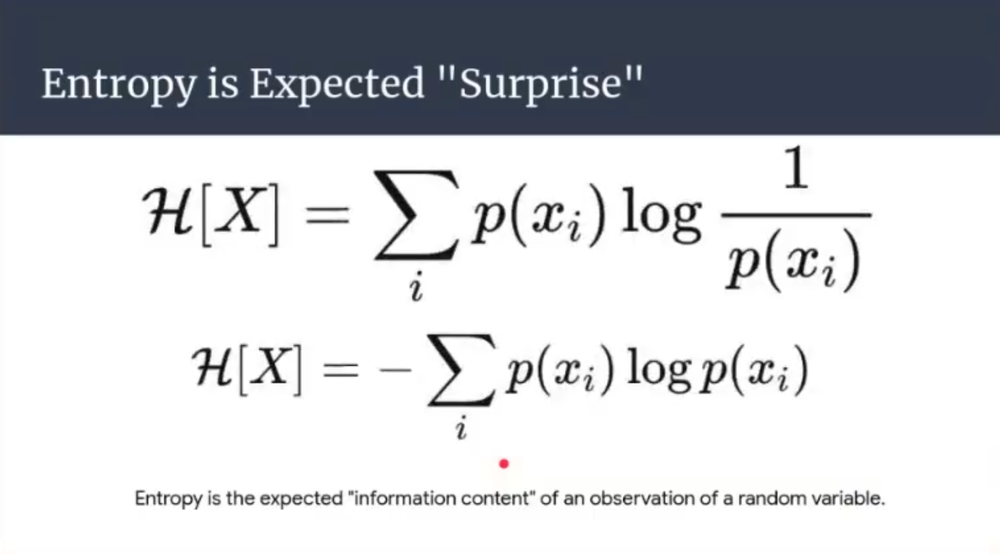

Alternatively, entropy is relative entropy/KL divergence with respect to a uniform distribution.

relative entropy (KL divergence) of distribution $p(x)$ of discrete variable $X$ with respect to the uniform distribution

For example, for discrete variable $X$ with uniform distribution $\implies u(x_i) = \frac{1}{N}$:

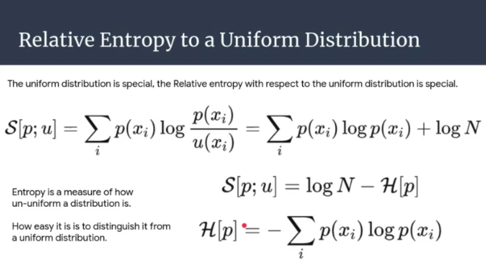

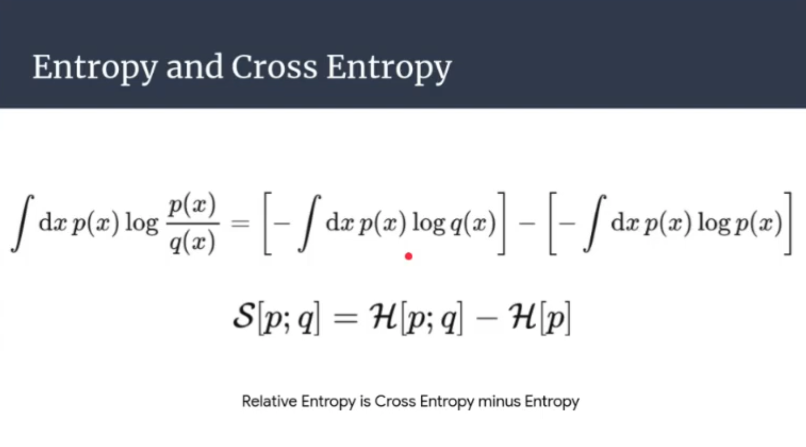

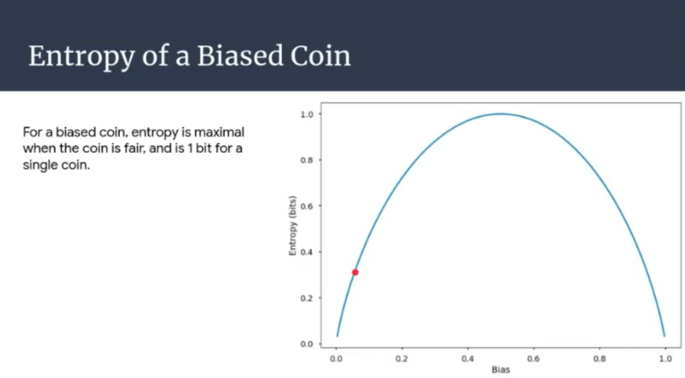

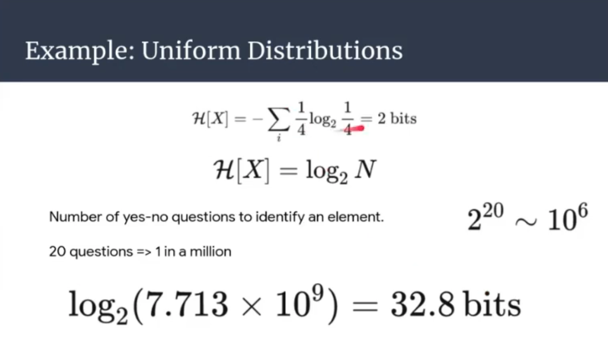

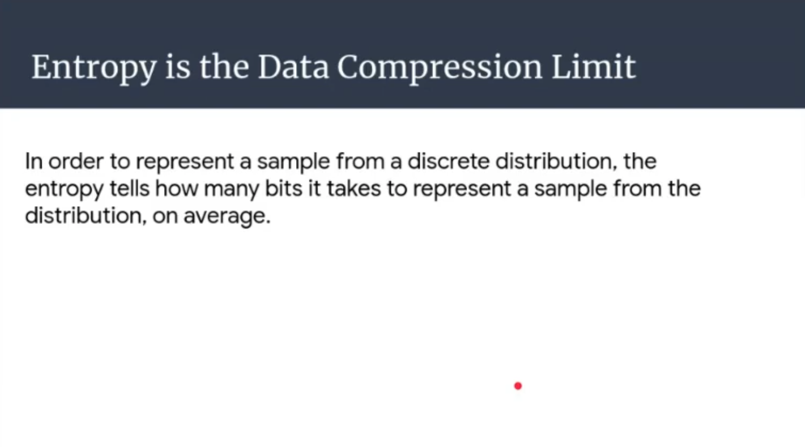

See cards and biased cards examples, bits/sample interpretation of entropy, and [asymptotic equipartition property](https://en.wikipedia.org/wiki/Asymptotic_equipartition_property) in [original lecture](https://youtu.be/hwZU-O0_12g).

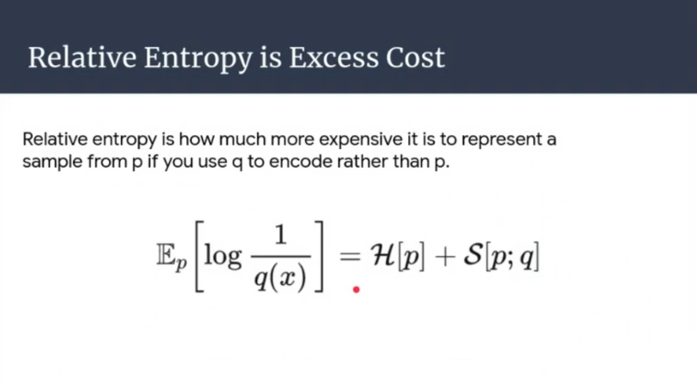

$$\mathbb{E}_{x \sim p(x)}[-\log q(x)] - \mathbb{E}_{x \sim p}[-\log p(x)] = H(p, q) - H(p) = D_{\rm KL}(p \parallel q)$$

## Entropy

The uniform distribution is special and therefore the relative entropy (KL divergence) of distribution $p(x)$ of variable $X$ with respect to its uniform distribution is special.

If variable $X$ is discrete, its uniform distribution $u(x)$ is:

$$u(x) = \frac{1}{|\mathcal{X}|} = \frac{1}{N}$$

**Entropy** is the relative entropy (KL divergence) of a distribution with respect to its uniform distribution:

$$\begin{align}
D_{\rm KL}(p \| u) 
&=
\sum_x p(x) \cdot \log \frac{p(x)}{u(x)} \\
&=
\sum_x p(x) \log \frac{p(x)}{1/N} \\
&=
\sum_x p(x) \log \big( p(x) \cdot N \big) \\
&=
\sum_x p(x) \big[ \log p(x) + \log N \big] \\
&=
\sum_x p(x) \log p(x) + \sum_x p(x) \log N \\
&=
\sum_x p(x) \log p(x) + \log N \cdot \sum_x p(x) \\
&=
\sum_x p(x) \log p(x) + \log N \\
\end{align}$$

$$H(p) = - \sum_x p(x) \log p(x)$$

Therefore,

$$D_{\rm KL}(p\|u) = - H(p) + \log N = \log N - H(p)$$

or

$$H(p) = \log N - D_{\rm KL}(p \| u)$$

The [entropy of continuous variables/distributions](https://en.wikipedia.org/wiki/Differential_entropy) is silly; it depends on the [unit of measurement](https://en.wikipedia.org/wiki/Unit_of_measurement) and can be negative! When comparing the entropy of different continuous distributions $p(x)$, the range of the uniform distribution $u(x)$ used as reference must be specified.

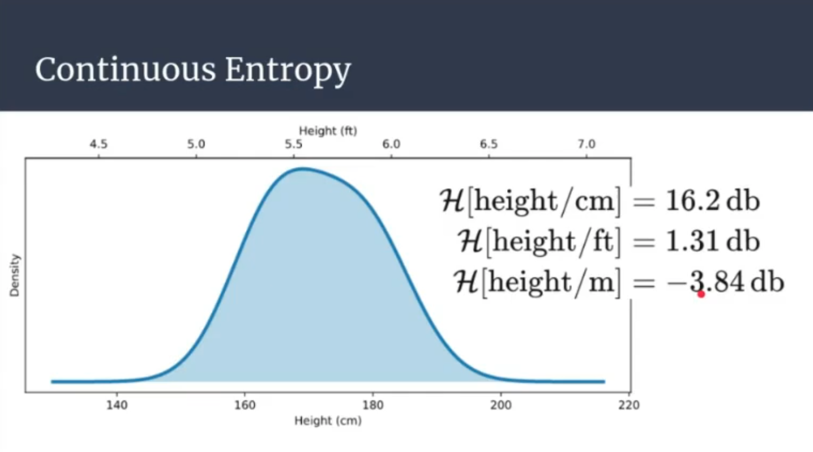

Entropy is a measure of ignorance.

Entropy is a measure of how un-uniform a distribution is, i.e., how easy it is to distinguish it from a uniform distribution.

$$D_{\rm KL}(p \| u) = \log N - H(p)$$

## Mutual information

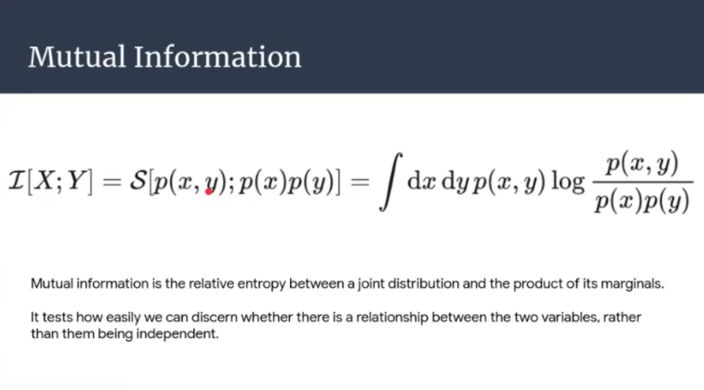

Mutual information is the relative entropy (KL divergence) of a joint distribution and the product of its marginal distributions:

$$I(X;Y) = D_{\rm KL}[p(x,y);p(x)p(y)] = \sum_{x,y} p(x, y) \cdot \log \frac{p(x,y)}{p(x)p(y)}$$

Mutual information is the expected reduction of uncertainty in $X$ after observing $Y$ (and viceversa).

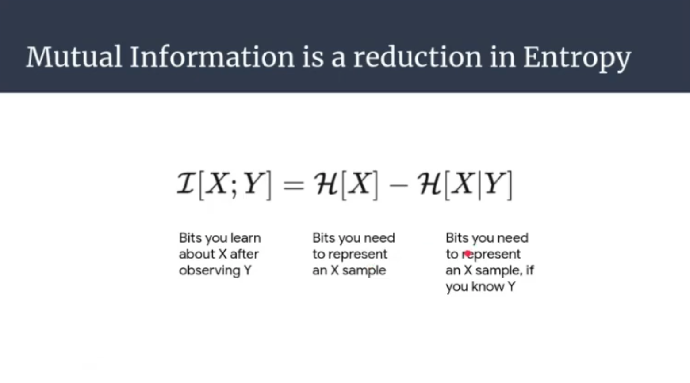

$$I(X;Y) = H(X) - H(X \mid Y)$$

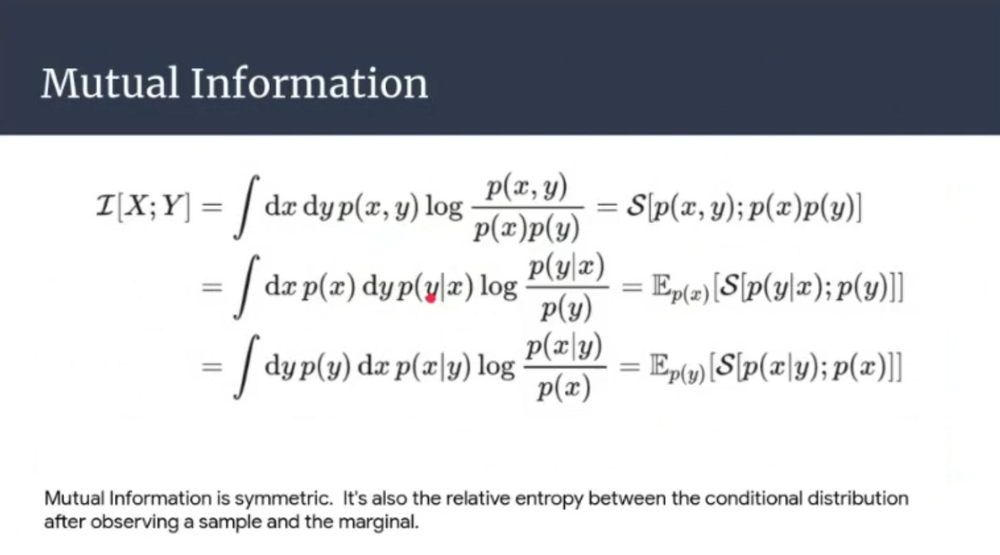

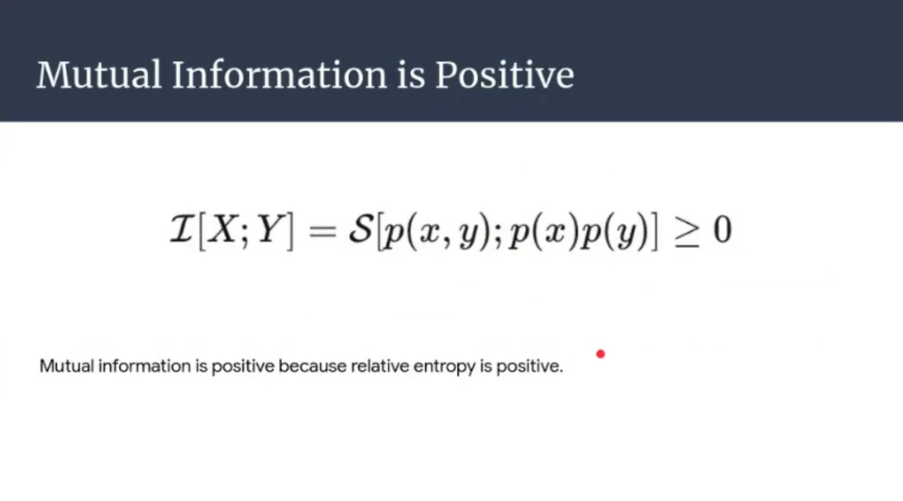


$$\begin{aligned}
I(X;Y)
&= H(X) - H(X\mid Y) \\
&= H(Y) - H(Y\mid X) \\
&= H(X) + H(Y) - H(X,Y) \\
&= H(X,Y) - H(X\mid Y) - H(Y\mid X).
\end{aligned}$$

## Data processing inequality

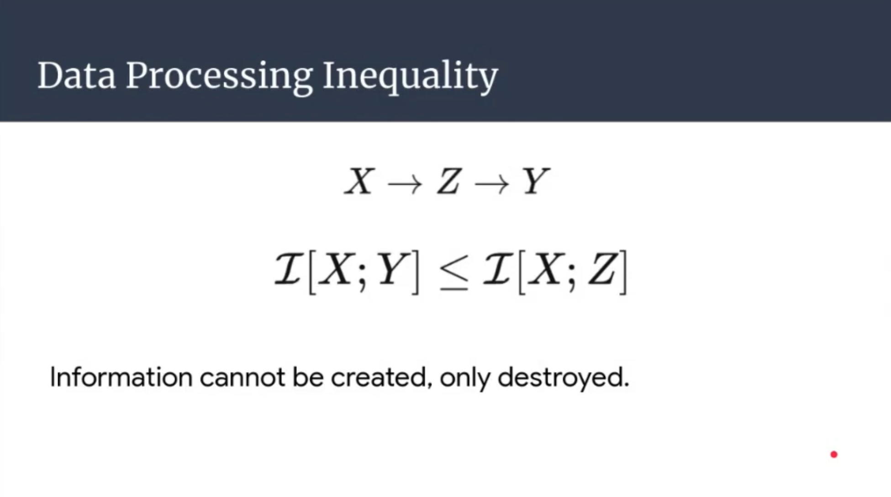

For a Markov chain, where $X$ is transformed into $Z$ and in turn $Z$ is transformed into $Y$, the [data processing inequality](https://en.wikipedia.org/wiki/Data_processing_inequality) states that:

$$I(X;Y) \le I(X;Z)$$

For example, for a deterministic transformation $Y=f(Z)$, the data processing inequality states that:

$$I(X;f(Z))\leq I(X;Z)$$ Information is either preserved or lost, never increased, under data processing.

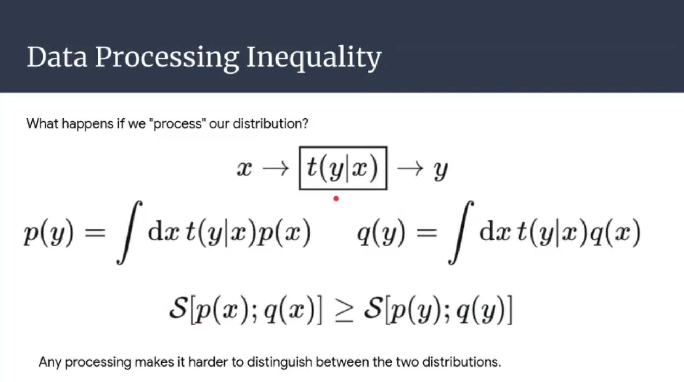

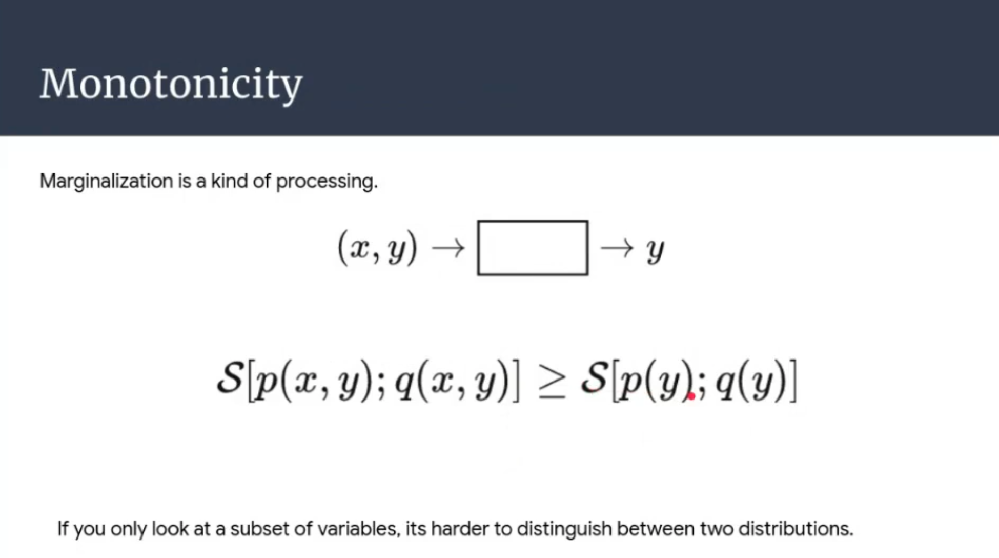

## Signal and noise

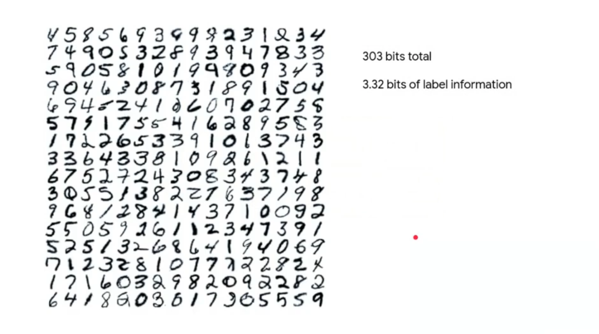

Signal (e.g., label information = what digit is the image of?) is, in this example, \~1% of total information.

Our task as machine learners is to separate the "signal" (e.g., label information = what digit is the image of?) from the "noise" (information not relevant to our question).

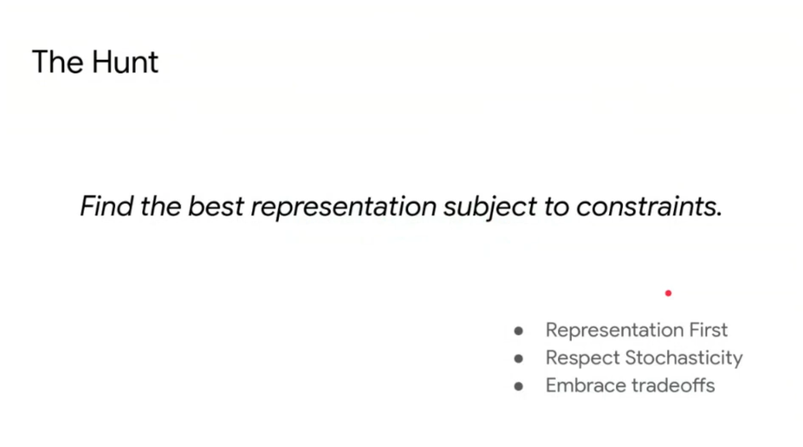


## A principle for learning: cross-entropy minimization

For a single variable $X$:

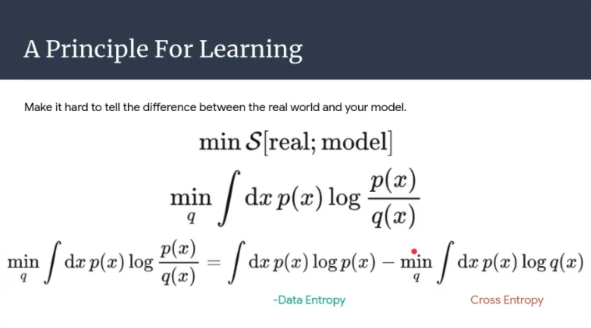

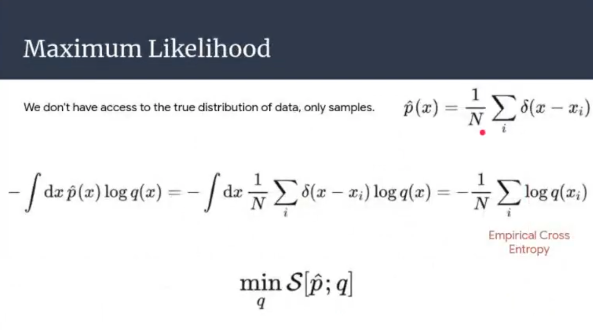

Minimize the "distance/difference" (relative entropy/KL divergence) between the real world $p(x)$ and a model of the world $q(x)$:

$$\min_q \mathcal{S}[\text{p};\text{q}] = \min_q \sum_x p(x) \cdot \log\frac{p(x)}{q(x)} = \min_q (\mathcal{H}[p;q] - \mathcal{H}[p])$$

which (since entropy does not depend on $q$) is equivalent to minimizing the **cross-entropy**:

$$\min_q \mathcal{H}[p;q] = \min_q \big(- \sum_x p(x) \cdot \log q(x)\big)$$

But we do not know $p(x)$, i.e., we do not have access to all data points/the true distribution of the data, only $n$ samples, i.e., the empirical distribution of the data $\hat p(x)$:

$$\hat p(x) = \frac{1}{n} \sum_i \delta(x - x_i)$$

Assuming $\hat p(x)$ is a good approximation of $p(x)$:

$$\mathcal{H}[\hat p;q]
=
- \sum_x \hat p(x) \cdot \log q(x)
=
- \sum_x \frac{1}{n} \sum_i \delta(x - x_i) \cdot \log q(x)
=
- \frac{1}{n} \sum_i \log q(x_i)$$

minimizing this **empirical cross-entropy** is equivalent to maximizing the likelihood of the observed data.

## Variational autoencoders

For two variables $X$ and $Z$:

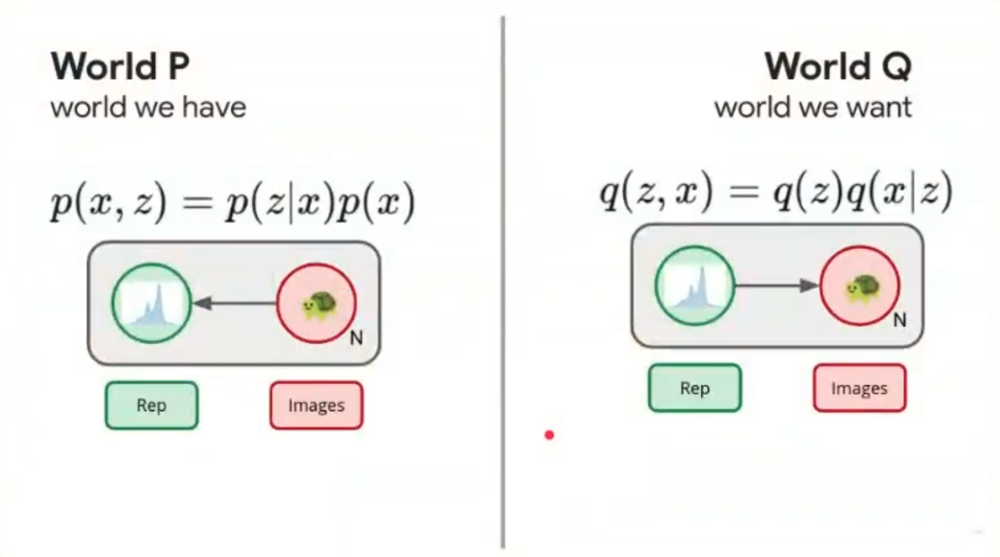

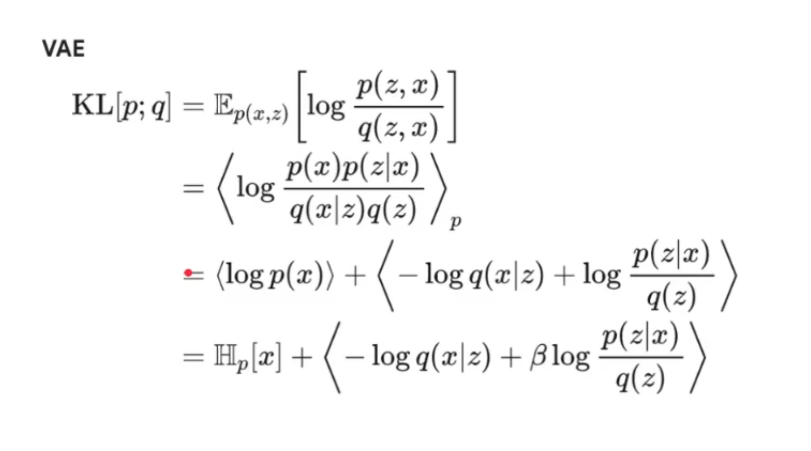

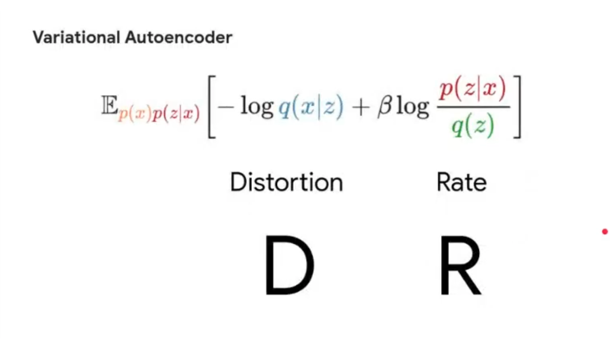

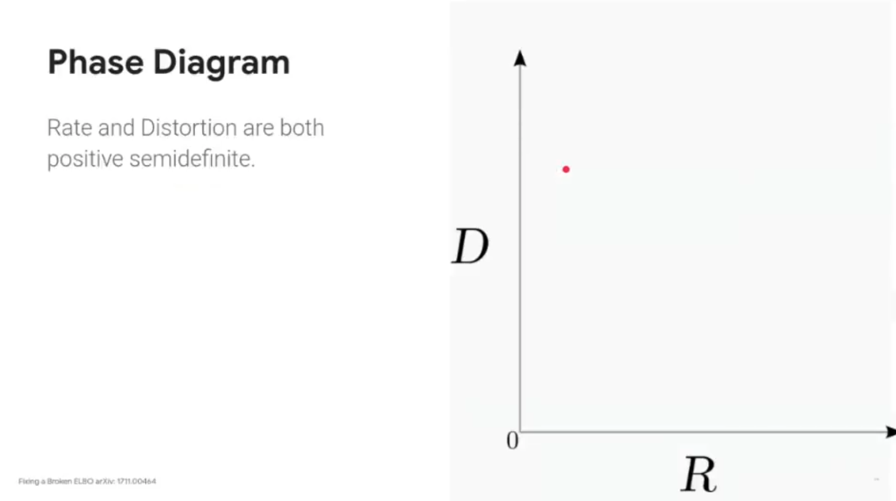

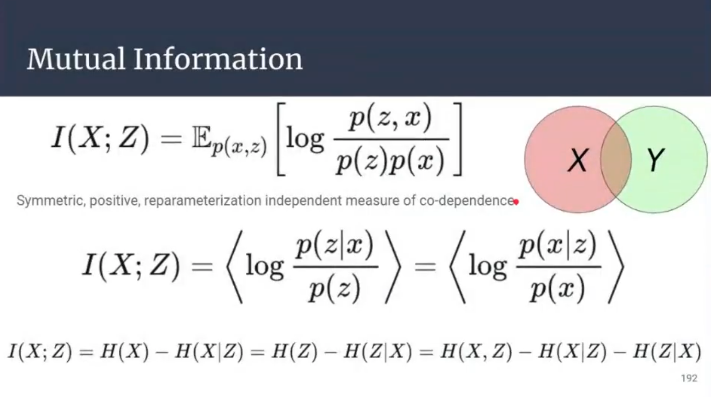

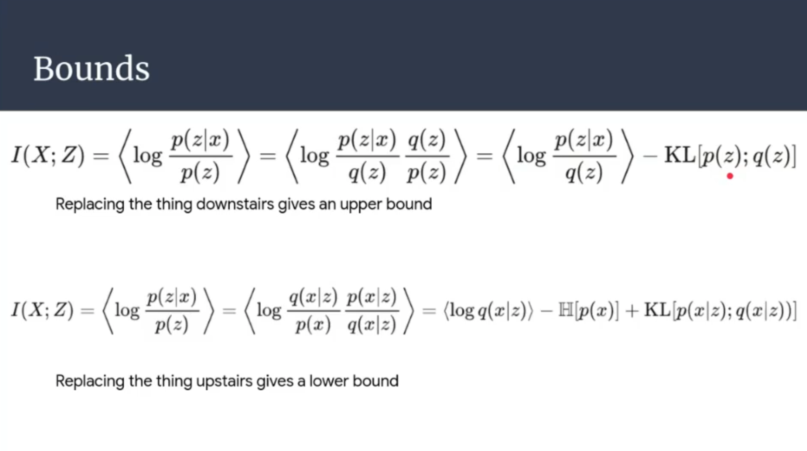
